<picture>
  <source media="(prefers-color-scheme: dark)" srcset="assets/header-dark.svg">
  
</picture>

  <a href="https://github.com/solacode-SC"><picture><source media="(prefers-color-scheme: dark)" srcset="assets/btn-github-dark.svg"></picture></a>
  <a href="https://www.linkedin.com/in/solayman-elmouden"><picture><source media="(prefers-color-scheme: dark)" srcset="assets/btn-linkedin-dark.svg"></picture></a>
  <a href="https://solaymantech.me"><picture><source media="(prefers-color-scheme: dark)" srcset="assets/btn-portfolio-dark.svg"></picture></a>

<picture>
  <source media="(prefers-color-scheme: dark)" srcset="assets/about-dark.svg">
  
</picture>

  

<picture>
  <source media="(prefers-color-scheme: dark)" srcset="assets/skills-dark.svg">
  
</picture>

  

<picture>
  <source media="(prefers-color-scheme: dark)" srcset="assets/projects-title-dark.svg">
  
</picture>

<a href="https://github.com/solacode-SC/lazyequation"><picture><source media="(prefers-color-scheme: dark)" srcset="assets/card-lazyequation-dark.svg"></picture></a>
<a href="https://github.com/solacode-SC/leetresume"><picture><source media="(prefers-color-scheme: dark)" srcset="assets/card-leetresume-dark.svg"></picture></a>

<a href="https://github.com/solacode-SC/libora"><picture><source media="(prefers-color-scheme: dark)" srcset="assets/card-libora-dark.svg"></picture></a>
<a href="https://github.com/solacode-SC/webserv"><picture><source media="(prefers-color-scheme: dark)" srcset="assets/card-webserv-dark.svg"></picture></a>

<a href="https://github.com/solacode-SC/solajobs-v2"><picture><source media="(prefers-color-scheme: dark)" srcset="assets/card-solajobsv2-dark.svg"></picture></a>

 

<a href="https://solaymantech.me"><picture>
  <source media="(prefers-color-scheme: dark)" srcset="assets/footer-dark.svg">
  
</picture></a>

<a href="https://solaymantech.me">solaymantech.me</a> · <a href="https://www.linkedin.com/in/solayman-elmouden">LinkedIn</a>

