

<picture><source media="(prefers-color-scheme: dark)" srcset="./assets/header-dark.svg"><source media="(prefers-color-scheme: light)" srcset="./assets/header-light.svg">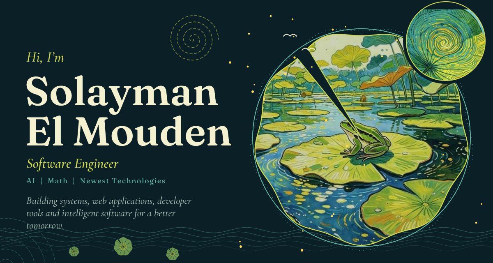</picture>

<picture><source media="(prefers-color-scheme: dark)" srcset="./assets/divider-dark.svg"><source media="(prefers-color-scheme: light)" srcset="./assets/divider-light.svg">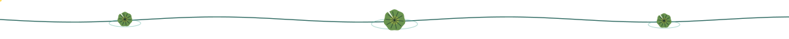</picture>

<picture><source media="(prefers-color-scheme: dark)" srcset="./assets/about-dark.svg"><source media="(prefers-color-scheme: light)" srcset="./assets/about-light.svg">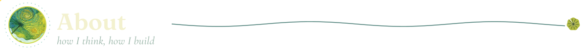</picture>

I’m Solayman El Mouden, a software engineer focused on systems, web technologies, artificial intelligence and mathematics.

I enjoy understanding how things work underneath the abstraction and turning that knowledge into useful software.

<picture><source media="(prefers-color-scheme: dark)" srcset="./assets/approach-dark.svg"><source media="(prefers-color-scheme: light)" srcset="./assets/approach-light.svg">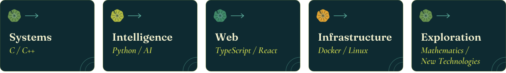</picture>

<picture><source media="(prefers-color-scheme: dark)" srcset="./assets/divider-dark.svg"><source media="(prefers-color-scheme: light)" srcset="./assets/divider-light.svg"></picture>

<picture><source media="(prefers-color-scheme: dark)" srcset="./assets/skills-dark.svg"><source media="(prefers-color-scheme: light)" srcset="./assets/skills-light.svg">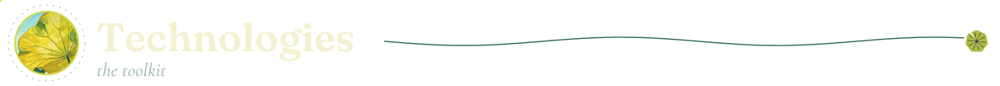</picture>

<picture><source media="(prefers-color-scheme: dark)" srcset="./assets/skills-grid-dark.svg"><source media="(prefers-color-scheme: light)" srcset="./assets/skills-grid-light.svg">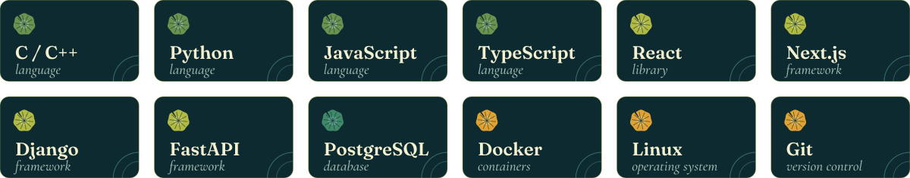</picture>

<picture><source media="(prefers-color-scheme: dark)" srcset="./assets/divider-dark.svg"><source media="(prefers-color-scheme: light)" srcset="./assets/divider-light.svg"></picture>

<picture><source media="(prefers-color-scheme: dark)" srcset="./assets/projects-title-dark.svg"><source media="(prefers-color-scheme: light)" srcset="./assets/projects-title-light.svg">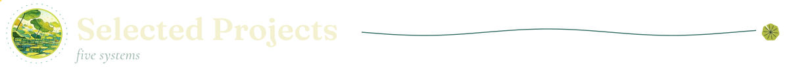</picture>

<table>
<tr>
<td width="50%"><a href="https://github.com/solacode-SC/lazyequation"><picture><source media="(prefers-color-scheme: dark)" srcset="./assets/card-lazyequation-dark.svg"><source media="(prefers-color-scheme: light)" srcset="./assets/card-lazyequation-light.svg">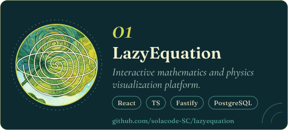</picture></a></td>
<td width="50%"><a href="https://github.com/solacode-SC/leetresume"><picture><source media="(prefers-color-scheme: dark)" srcset="./assets/card-leetresume-dark.svg"><source media="(prefers-color-scheme: light)" srcset="./assets/card-leetresume-light.svg">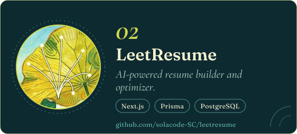</picture></a></td>
</tr>
<tr>
<td width="50%"><a href="https://github.com/solacode-SC/libora"><picture><source media="(prefers-color-scheme: dark)" srcset="./assets/card-libora-dark.svg"><source media="(prefers-color-scheme: light)" srcset="./assets/card-libora-light.svg">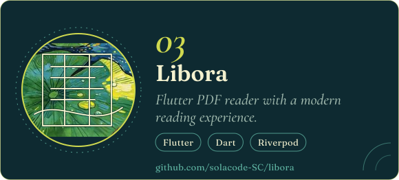</picture></a></td>
<td width="50%"><a href="https://github.com/solacode-SC/webserv"><picture><source media="(prefers-color-scheme: dark)" srcset="./assets/card-webserv-dark.svg"><source media="(prefers-color-scheme: light)" srcset="./assets/card-webserv-light.svg">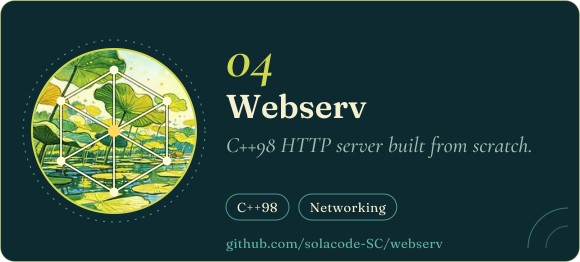</picture></a></td>
</tr>
<tr>
<td colspan="2"><a href="https://github.com/solacode-SC/solajobs-v2"><picture><source media="(prefers-color-scheme: dark)" srcset="./assets/card-solajobs-v2-dark.svg"><source media="(prefers-color-scheme: light)" srcset="./assets/card-solajobs-v2-light.svg">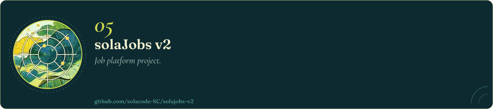</picture></a></td>
</tr>
</table>

<picture><source media="(prefers-color-scheme: dark)" srcset="./assets/footer-dark.svg"><source media="(prefers-color-scheme: light)" srcset="./assets/footer-light.svg"></picture>

[solaymantech.me](https://solaymantech.me) · [LinkedIn](https://www.linkedin.com/in/YOUR-LINKEDIN)

