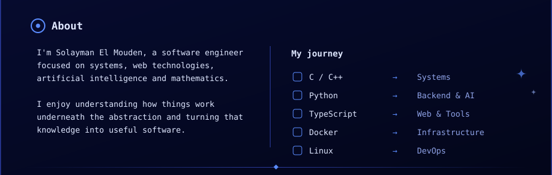
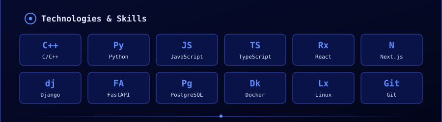
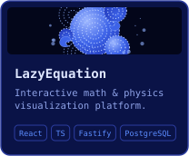
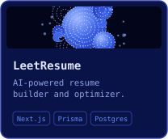
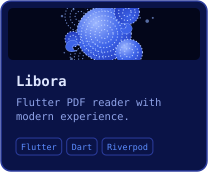
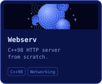

<picture>
  <source media="(prefers-color-scheme: dark)" srcset="assets/header-dark.svg">
  <source media="(prefers-color-scheme: light)" srcset="assets/header-light.svg">
  
</picture>

 
<a href="https://github.com/solacode-SC"><picture>
  <source media="(prefers-color-scheme: dark)" srcset="assets/btn-github-dark.svg">
  <source media="(prefers-color-scheme: light)" srcset="assets/btn-github-light.svg">
  
</picture></a>&nbsp;
<a href="https://www.linkedin.com/in/YOUR-LINKEDIN"><picture>
  <source media="(prefers-color-scheme: dark)" srcset="assets/btn-linkedin-dark.svg">
  <source media="(prefers-color-scheme: light)" srcset="assets/btn-linkedin-light.svg">
  
</picture></a>&nbsp;
<a href="https://solaymantech.me"><picture>
  <source media="(prefers-color-scheme: dark)" srcset="assets/btn-portfolio-dark.svg">
  <source media="(prefers-color-scheme: light)" srcset="assets/btn-portfolio-light.svg">
  
</picture></a>

<picture>
  <source media="(prefers-color-scheme: dark)" srcset="assets/about-dark.svg">
  <source media="(prefers-color-scheme: light)" srcset="assets/about-light.svg">
  
</picture>

<picture>
  <source media="(prefers-color-scheme: dark)" srcset="assets/skills-dark.svg">
  <source media="(prefers-color-scheme: light)" srcset="assets/skills-light.svg">
  
</picture>

<picture>
  <source media="(prefers-color-scheme: dark)" srcset="assets/projects-title-dark.svg">
  <source media="(prefers-color-scheme: light)" srcset="assets/projects-title-light.svg">
  
</picture>

<a href="https://github.com/solacode-SC/lazyequation"><picture>
  <source media="(prefers-color-scheme: dark)" srcset="assets/card-lazyequation-dark.svg">
  <source media="(prefers-color-scheme: light)" srcset="assets/card-lazyequation-light.svg">
  
</picture></a>
<a href="https://github.com/solacode-SC/leetresume"><picture>
  <source media="(prefers-color-scheme: dark)" srcset="assets/card-leetresume-dark.svg">
  <source media="(prefers-color-scheme: light)" srcset="assets/card-leetresume-light.svg">
  
</picture></a>
<a href="https://github.com/solacode-SC/libora"><picture>
  <source media="(prefers-color-scheme: dark)" srcset="assets/card-libora-dark.svg">
  <source media="(prefers-color-scheme: light)" srcset="assets/card-libora-light.svg">
  
</picture></a>
<a href="https://github.com/solacode-SC/webserv"><picture>
  <source media="(prefers-color-scheme: dark)" srcset="assets/card-webserv-dark.svg">
  <source media="(prefers-color-scheme: light)" srcset="assets/card-webserv-light.svg">
  
</picture></a>

<picture>
  <source media="(prefers-color-scheme: dark)" srcset="assets/footer-dark.svg">
  <source media="(prefers-color-scheme: light)" srcset="assets/footer-light.svg">
  
</picture>

<a href="https://solaymantech.me">solaymantech.me</a> &nbsp;·&nbsp; <a href="https://www.linkedin.com/in/YOUR-LINKEDIN">LinkedIn</a>

