

  <picture>
    <source media="(prefers-color-scheme: dark)"  srcset="assets/hero-dark.svg">
    <source media="(prefers-color-scheme: light)" srcset="assets/hero-light.svg">
    
  </picture>

<a href="https://github.com/solacode-SC">
  <picture>
    <source media="(prefers-color-scheme: dark)"  srcset="assets/btn-github-dark.svg">
    <source media="(prefers-color-scheme: light)" srcset="assets/btn-github-light.svg">
    
  </picture>
</a> &nbsp; <a href="https://www.linkedin.com/in/YOUR-LINKEDIN">
  <picture>
    <source media="(prefers-color-scheme: dark)"  srcset="assets/btn-linkedin-dark.svg">
    <source media="(prefers-color-scheme: light)" srcset="assets/btn-linkedin-light.svg">
    
  </picture>
</a> &nbsp; <a href="https://solaymantech.me">
  <picture>
    <source media="(prefers-color-scheme: dark)"  srcset="assets/btn-portfolio-dark.svg">
    <source media="(prefers-color-scheme: light)" srcset="assets/btn-portfolio-light.svg">
    
  </picture>
</a>

  <picture>
    <source media="(prefers-color-scheme: dark)"  srcset="assets/about-dark.svg">
    <source media="(prefers-color-scheme: light)" srcset="assets/about-light.svg">
    
  </picture>

  <picture>
    <source media="(prefers-color-scheme: dark)"  srcset="assets/skills-dark.svg">
    <source media="(prefers-color-scheme: light)" srcset="assets/skills-light.svg">
    
  </picture>

  <picture>
    <source media="(prefers-color-scheme: dark)"  srcset="assets/projects-title-dark.svg">
    <source media="(prefers-color-scheme: light)" srcset="assets/projects-title-light.svg">
    
  </picture>

<a href="https://github.com/solacode-SC/lazyequation">
  <picture>
    <source media="(prefers-color-scheme: dark)"  srcset="assets/card-lazyequation-dark.svg">
    <source media="(prefers-color-scheme: light)" srcset="assets/card-lazyequation-light.svg">
    
  </picture>
</a>
<a href="https://github.com/solacode-SC/leetresume">
  <picture>
    <source media="(prefers-color-scheme: dark)"  srcset="assets/card-leetresume-dark.svg">
    <source media="(prefers-color-scheme: light)" srcset="assets/card-leetresume-light.svg">
    
  </picture>
</a>
<a href="https://github.com/solacode-SC/libora">
  <picture>
    <source media="(prefers-color-scheme: dark)"  srcset="assets/card-libora-dark.svg">
    <source media="(prefers-color-scheme: light)" srcset="assets/card-libora-light.svg">
    
  </picture>
</a>
<a href="https://github.com/solacode-SC/webserv">
  <picture>
    <source media="(prefers-color-scheme: dark)"  srcset="assets/card-webserv-dark.svg">
    <source media="(prefers-color-scheme: light)" srcset="assets/card-webserv-light.svg">
    
  </picture>
</a>

<a href="https://github.com/solacode-SC/solajobs-v2">
  <picture>
    <source media="(prefers-color-scheme: dark)"  srcset="assets/card-solajobs-v2-dark.svg">
    <source media="(prefers-color-scheme: light)" srcset="assets/card-solajobs-v2-light.svg">
    
  </picture>
</a>
<a href="https://github.com/solacode-SC/prometheus-alert-generator">
  <picture>
    <source media="(prefers-color-scheme: dark)"  srcset="assets/card-prometheus-alert-generator-dark.svg">
    <source media="(prefers-color-scheme: light)" srcset="assets/card-prometheus-alert-generator-light.svg">
    
  </picture>
</a>
<a href="https://github.com/solacode-SC/docker-compose-dashboard">
  <picture>
    <source media="(prefers-color-scheme: dark)"  srcset="assets/card-docker-compose-dashboard-dark.svg">
    <source media="(prefers-color-scheme: light)" srcset="assets/card-docker-compose-dashboard-light.svg">
    
  </picture>
</a>

  <picture>
    <source media="(prefers-color-scheme: dark)"  srcset="assets/footer-dark.svg">
    <source media="(prefers-color-scheme: light)" srcset="assets/footer-light.svg">
    
  </picture>

