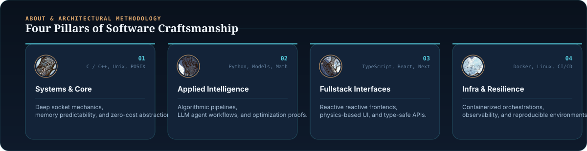
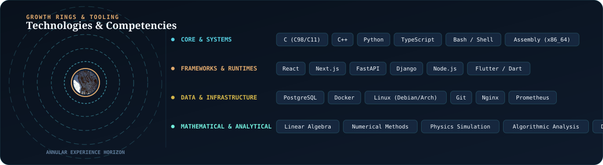
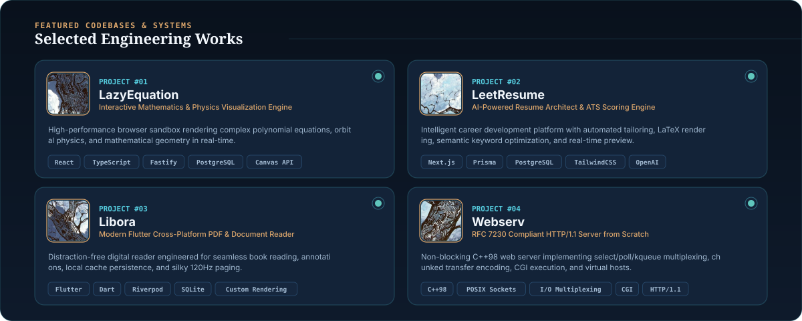

<!-- HERO BANNER -->
<picture>
  <source media="(prefers-color-scheme: dark)" srcset="assets/header-dark.svg">
  <source media="(prefers-color-scheme: light)" srcset="assets/header-light.svg">
  
</picture>

 

<!-- CONNECT BUTTONS -->

  
  &nbsp;
  
  &nbsp;
  

<!-- SECTION DIVIDER -->
<picture>
  <source media="(prefers-color-scheme: dark)" srcset="assets/divider-dark.svg">
  <source media="(prefers-color-scheme: light)" srcset="assets/divider-light.svg">
  
</picture>

 

<!-- FOUR PILLARS / ABOUT -->
<picture>
  <source media="(prefers-color-scheme: dark)" srcset="assets/about-dark.svg">
  <source media="(prefers-color-scheme: light)" srcset="assets/about-light.svg">
  
</picture>

  

<!-- GROWTH RINGS / SKILLS MATRIX -->
<picture>
  <source media="(prefers-color-scheme: dark)" srcset="assets/skills-dark.svg">
  <source media="(prefers-color-scheme: light)" srcset="assets/skills-light.svg">
  
</picture>

  

<!-- SECTION DIVIDER -->
<picture>
  <source media="(prefers-color-scheme: dark)" srcset="assets/divider-dark.svg">
  <source media="(prefers-color-scheme: light)" srcset="assets/divider-light.svg">
  
</picture>

 

<!-- CURATED PROJECTS GRID -->
<picture>
  <source media="(prefers-color-scheme: dark)" srcset="assets/projects-grid-dark.svg">
  <source media="(prefers-color-scheme: light)" srcset="assets/projects-grid-light.svg">
  
</picture>

 

<!-- QUICK PROJECT ACCESS LINKS -->

  <a href="https://github.com/solacode-SC/lazyequation"><b>[ 01 · LazyEquation ]</b></a> &nbsp;•&nbsp; 
  <a href="https://github.com/solacode-SC/leetresume"><b>[ 02 · LeetResume ]</b></a> &nbsp;•&nbsp; 
  <a href="https://github.com/solacode-SC/libora"><b>[ 03 · Libora ]</b></a> &nbsp;•&nbsp; 
  <a href="https://github.com/solacode-SC/webserv"><b>[ 04 · Webserv ]</b></a>

 

<!-- FOOTER -->
<picture>
  <source media="(prefers-color-scheme: dark)" srcset="assets/footer-dark.svg">
  <source media="(prefers-color-scheme: light)" srcset="assets/footer-light.svg">
  
</picture>

 

Designed with organic topographic algorithms · <a href="https://solaymantech.me">solaymantech.me</a>

