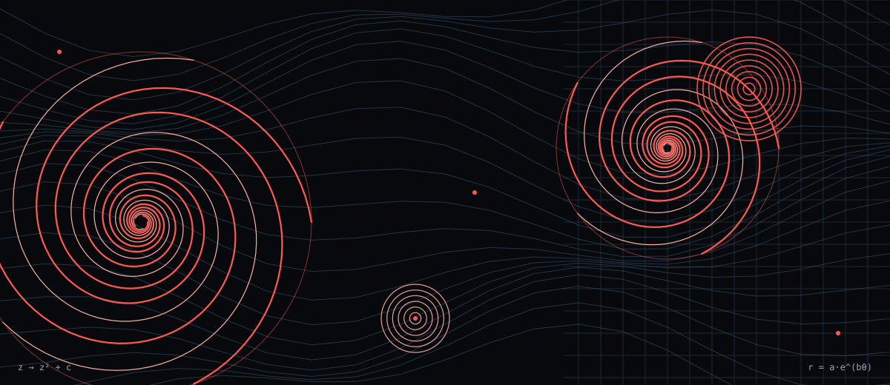
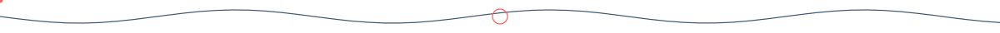
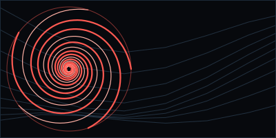
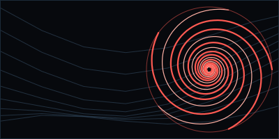

<picture>
  <source media="(prefers-color-scheme: dark)" srcset="./assets/hero-dark.svg">
  <source media="(prefers-color-scheme: light)" srcset="./assets/hero-light.svg">
  
</picture>

# [YOUR NAME]

**[YOUR ROLE / TITLE]** — [one sentence about what you build]

<picture><source media="(prefers-color-scheme: dark)" srcset="./assets/divider-dark.svg"><source media="(prefers-color-scheme: light)" srcset="./assets/divider-light.svg"></picture>

## About

I'm [a short, personal introduction: what you study or build, and why mathematics, AI or physics pulls you in]. [Second sentence: the kind of systems you like to work on.]

## How I work

| | |
|---|---|
| **Systems** | [C / C++ — edit] |
| **Intelligence** | [Python / AI — edit] |
| **Web** | [TypeScript / React — edit] |
| **Infrastructure** | [Docker / Linux — edit] |
| **Exploration** | [Mathematics / Physics — edit] |

<picture><source media="(prefers-color-scheme: dark)" srcset="./assets/divider-dark.svg"><source media="(prefers-color-scheme: light)" srcset="./assets/divider-light.svg"></picture>

## Technologies

Placeholder badges. Keep only what you actually use.

## Selected projects

<table>
<tr>
<td width="33%" valign="top">
<picture><source media="(prefers-color-scheme: dark)" srcset="./assets/project-1-dark.svg"><source media="(prefers-color-scheme: light)" srcset="./assets/project-1-light.svg"></picture>

**[Project one]** [One-line description] [tech · tech] [Repo](https://github.com/[username]/[repo])
</td>
<td width="33%" valign="top">
<picture><source media="(prefers-color-scheme: dark)" srcset="./assets/project-2-dark.svg"><source media="(prefers-color-scheme: light)" srcset="./assets/project-2-light.svg"></picture>

**[Project two]** [One-line description] [tech · tech] [Repo](https://github.com/[username]/[repo])
</td>
<td width="33%" valign="top">
<picture><source media="(prefers-color-scheme: dark)" srcset="./assets/project-3-dark.svg"><source media="(prefers-color-scheme: light)" srcset="./assets/project-3-light.svg"></picture>

**[Project three]** [One-line description] [tech · tech] [Repo](https://github.com/[username]/[repo])
</td>
</tr>
</table>

## Currently exploring

[Optional: one or two lines, e.g. fractals, dynamical systems, generative art. Delete if unused.]

<picture><source media="(prefers-color-scheme: dark)" srcset="./assets/divider-dark.svg"><source media="(prefers-color-scheme: light)" srcset="./assets/divider-light.svg"></picture>

[short closing phrase] · <a href="https://[your-site]">portfolio</a> · <a href="https://linkedin.com/in/[handle]">linkedin</a>

